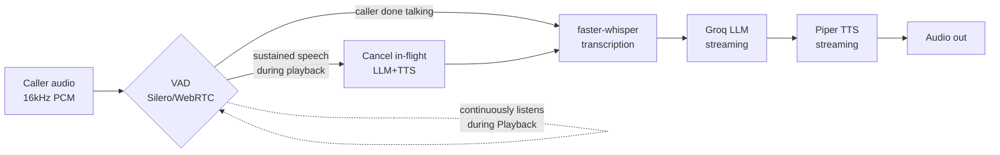

# Low-Latency Interruptible Voice Agent for Support Ticket Triage
A voice interface for triaging support tickets that can be genuinely interrupted mid-response — not just talked over — for teams whose voice-agent demos break down the moment a real caller tries to interrupt them.

**Live demo:** _[filled in at deploy stage — see DECISIONS.md "Deploy target"]_

## Problem
Most voice-agent demos can't handle a caller interrupting mid-response: the agent either keeps talking over them or the whole turn-taking logic breaks. That's a known, current hard problem in voice AI — real conversation is full of interruptions ("wait, actually...", "no hold on...", correcting yourself mid-sentence) and an agent that can't handle that isn't usable for a real phone call. This project builds one specific, narrow slice of that: a support-ticket-triage agent (caller describes an issue by voice, the agent classifies urgency/category and responds) where the caller can interrupt the agent's response at any point, and the agent actually stops and responds to the interruption instead of ignoring it or finishing its sentence first.

## Approach

- **Barge-in detection is VAD, not STT.** `faster-whisper`'s partial transcripts have too much latency (1-2s context) to serve as the interrupt trigger itself — VAD (Silero primary, WebRTC as a lighter fallback) answers "has the caller started talking" in ~32ms frames; STT only runs *after* a barge-in fires, to transcribe what was actually said. See `voice_agent/vad.py`.
- **A single `TurnTimings` record spans the cancel/restart boundary.** `t_vad_fire`/`t_playback_stopped` belong to the interrupted turn; `t_new_audio_start` belongs to its replacement — recreating a fresh record per turn would make recovery latency uncomputable. See `voice_agent/pipeline.py`'s `CallSession`.
- **Cutoff and recovery latency are reported separately, not blended.** They have different failure modes: cutoff is a buffering/cancellation problem (how fast audio actually stops), recovery is an LLM+TTS pipeline problem (how fast a new response starts). See Results below.
- **`simulate_speech`: a real debug/demo path, not a mock.** A JSON control message that synthesizes text into audio and feeds it through the *exact same* VAD/capture/pipeline code as genuine microphone input — built because this project's own automated testing (and this demo) can't rely on a real human microphone. Doubles as an actual interview-demo control for anyone without a mic. See `server.py`.
- Full reasoning for every non-obvious choice above — including a multi-bug debugging saga that all initially looked like the same "hang" but had three completely different causes — is in [DECISIONS.md](./DECISIONS.md).

## Results
Benchmarked on 5 scripted barge-in scenarios (real STT/LLM/TTS calls throughout, no simulated numbers — `eval/run_eval.py`), each: an opening support-ticket utterance, a response starts playing, a caller interruption fires a real barge-in.

| Metric | p50 | p95 | mean |
|---|---|---|---|
| **Cutoff latency** (audio actually stops) | 77 ms | 108 ms | 60 ms |
| **Recovery latency** (new response starts) | 2207 ms | 3155 ms | 2272 ms |

Cutoff is fast and consistent — cancelling an in-flight Piper stream and stopping playback is close to instant, with little room to vary. Recovery is dominated by the real STT → LLM → TTS round-trip for the interrupting utterance; that's the actual bottleneck, not the cancellation mechanism itself (see "What I'd do with more time").

Raw numbers: [`eval/results/latest.json`](./eval/results/latest.json).

## Tech Stack
- **FastAPI + WebSocket** (`server.py`) — one `/api/ws` connection carries mic audio in, playback audio and JSON events out. Deployed on Vercel Hobby's native WebSocket support (public beta as of mid-2026) — see DECISIONS.md "Deploy target" for why Vercel over Oracle Cloud/Fly.io/Railway, and the real bundle-size/config gotcha hit getting there.
- **Silero VAD** (primary) / **WebRTC VAD** (lighter fallback) — barge-in detection. Silero's exact 512-sample (32ms) frame requirement was discovered by testing, not assumed from docs.
- **faster-whisper** (CTranslate2-backed Whisper, CPU, int8) — transcription, off the hot barge-in-detection path.
- **Groq (`openai/gpt-oss-20b`)** — same model as the sibling `llm-cost-router` project, already verified working there; no reason to re-gamble on a different free-tier model.
- **Piper** (local, ONNX-backed) — streaming TTS, chosen over a hosted API specifically so a live interrupt-heavy demo doesn't depend on someone else's rate limits.
- A real background-thread + queue design in `voice_agent/tts.py` makes an in-flight Piper synthesis actually cancellable mid-stream, not just conceptually cancellable — that cancellation point is what cutoff latency measures.
- **AudioWorklet**, not the deprecated `ScriptProcessorNode`, for microphone capture (`public/mic-worklet.js`) — runs on a dedicated audio thread, which matters here specifically since barge-in timing accuracy is the thing being benchmarked.

## Run it
```bash
pip install -r requirements.txt -r requirements-dev.txt
cp .env.example .env          # fill in a real GROQ_API_KEY
uvicorn server:app --reload
```
Open `http://127.0.0.1:8000` — either **Start call** (real microphone) or **Demo mode** (no mic needed, type what the caller says and hit "Say it"; submit a second line while the agent is still replying to trigger a real barge-in — this is the same `simulate_speech` path the eval harness and demo video use).

Run the benchmark yourself:
```bash
python -m eval.run_eval
```

### Tests
```bash
pytest
```
56/56 passing, including a real Groq API integration test (needs `GROQ_API_KEY` in `.env`), real Silero/WebRTC VAD inference, a real Piper→faster-whisper round-trip, and a real end-to-end barge-in test via `simulate_speech`.

### Windows note
`webrtcvad` (the classic PyPI package) ships source-only with no prebuilt wheels for any platform, so it needs a C compiler to install locally on Windows. `requirements.txt` uses the `webrtcvad-wheels` fork instead (same API, real wheels) — see DECISIONS.md.

## What I'd do with more time
- **Cut recovery latency.** ~2.2s median is dominated by the real STT→LLM→TTS round-trip, not the cancellation mechanism. The LLM call already streams tokens into TTS sentence-by-sentence (not waiting for the full response), so the next lever is starting TTS on partial/unpunctuated text instead of waiting for sentence-ending punctuation, or a faster/smaller Whisper model for the interrupting utterance specifically.
- **A real human-microphone test pass.** `simulate_speech` verifies the entire server-side pipeline for real (this is what the Results table and demo video are built on), but the actual browser `getUserMedia` capture path has only been smoke-tested up to requesting mic permission — automation can't grant a real OS permission dialog. No JS test framework exists in this project either; the behavior that matters (real mic timing, AudioWorklet scheduling) can't be meaningfully unit-tested anyway.
- **A larger, more varied eval set.** 5 scripted scenarios is enough to get a real number, not enough to be confident about the distribution's tail — a bigger set with more varied interruption timing (immediately vs. deep into a long response) would give a more honest p95.
- **Multi-speaker distinction**, if this ever needed to tell two different real voices apart mid-conversation — out of scope for a single-caller triage line, but a real gap if extended to e.g. a group call.
